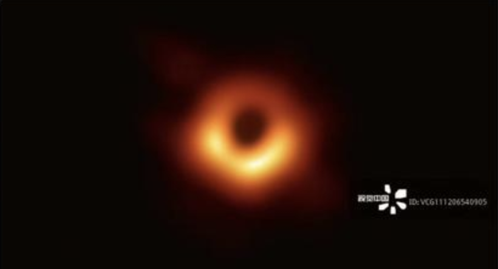

# 视觉中国

北京时间 2019年4月10日晚 世界第一张黑洞照片问世！
这张照片也在网上瞬间刷屏，但有网友称，视觉中国已经在国内拿下了这张黑洞图片的版权，用作商业用途将被追究赔偿。

[空青团中央怒怼视觉中国：国旗、国徽的版权也是贵公司的？@视觉中国影像](https://weibo.com/3937348351/Hp8sp9JzQ)

视觉中国水印生成器: https://wenotpro.github.io/vcg/

视觉中国 (vcg.com) 的劣迹请大家在 Issue 中补充
